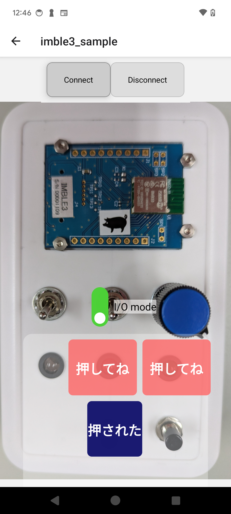

# IMBLE3 インターフェーステストアプリ
:toc:
:toc-levels: 3
:toc-title: 目次
:nofooter:
:sectnums:
:abstract-caption: 概要
:figure-caption: 図
:table-caption: 表

<<<

## 概要

link:https://www.interplan.co.jp/solution/wireless/imble/imble3_family.php[IMBLE3]の +
以下のモードのデモを行うスマホアプリ +
及びそれに付随する治具

- 接点入出力モード(ホールド)
- A/D 入力モード

<<<

## ハードウェア要件

### androidのバージョン
Android7(API Level 24)以上

### iOSのバージョン

[line-through]#iOS16.7以上#

将来対応とします

<<<

## 治具

### 概要

以下のモードについて
入力と出力を知覚させます

- 接点入出力モード(ホールド)
- A/D 入力モード

2極スイッチの選択で
容易にモード変更に対応します

### 外観

// image:images/apperence_demo.jpg[width="300"]

<<<

### 回路図

<<<

### 対応モード

.モード一覧
[options="autowidth"]
|===
| モード | スイッチ 
| 接点入出力モード(ホールド) | 下
| A/D 入力モード | 上
|===

### 入力ボタン

ボタンの配置は以下です

[options="autowidth"]
|===
|  1 | 2
|===

### 出力LED

LEDの配置は以下です

[options="autowidth"]
|===
| status| 1 | 2
|===

<<<

## アプリ

### 機能概要

- IMBLE3を探索し、表示します
- 指定したIMBLE3に接続します
- 接続済みのIMBLE3に対して、2入力の表示及び2出力の選択及び4入力電圧状況が表示可能な画面(以降表示画面)を表示します
- 入出力モードの場合、表示画面にて送信ボタンが押されると選択済みの2出力に対応したデータをIMBLE3に送信します
- 入出力モードの場合、IMBLE3からの送信内容をモニタし、2入力の表示を行います
- A/D入力モードの場合、IMBLE3からの送信内容をモニタし、電圧表示を行います
- 接続済みのIMBLE3に対して切断が可能

<<<

### インストール

androidスマホとパソコンを接続し
apkファイルをandroidスマホに転送します

#### USB接続での転送

. パソコンとアンドロイド端末をUSBケーブルで接続してください。

. アンドロイド端末を上からスワイプして +
「このデバイスをUSBで充電中」をタップします。
+

. タップしてその他オプションを表示してください。
+
<<<

. ファイル転送をタップします。
+

. パソコンからAndroid端末が見れるはずですので +
ファイルのドラッグ&ドロップなどで内部共有ストレージに保存してください。 +
ここでは内部共有ストレージ内のDownloadに保存したものとします。

<<<

### インストール
. Filesアプリを開きDownloadディレクトリを開きます。
+

. apkファイルをタップします。

. セキュリティーアラートが表示されたら「設定」をタップします。
+
image::images/security_alert.png[width="180"]
+
<<<

. 「この提供元のアプリを許可」をタップします。
+

. 「インストール」をタップします。
+

+
<<<

// . 「アプリをスキャン」をタップします。
// +
// image::images/scan.png[width="180"]

// . スキャンが終わるまでしばらく待ちます
// +
// image::images/scanning.png[width="180"]
// +
// <<<

// . 「インストール」をタップします。
// +
// image::images/reinstall.png[width="180"]

// <<<

### 使用方法

#### 入出力モード

接点情報の送受信を行う場合です

モード切替スイッチを下にします

電源スイッチをONにしてください +
数秒するとLED(ステータス)が点滅を始めます +
LEDが点滅を行わない場合、電源の入れ直しを行うと復旧する場合もあります

スマホアプリを起動してください +
初回起動時はBluetooth,位置情報関連の同意を求められます +
許可を行わない場合本アプリは使用出来ませんので同意をお願いします。

<<<

ホーム画面が表示されると自動的にスキャンが開始されます

<<<

見つかったIMBLEをタップするとデバイス画面に遷移し、接続されます

赤いボタンを押すと治具のLEDが光ったり消えたりします +
押している間光るのではなく、トグル(*1)切り替えなので注意してください

(*1)
奇数回押すと点灯、偶数回押すと消灯

<<<

接点入力ボタンを押すと以下のように画面に表示されます +
こちらはトグルではなく、押している間表示されるので注意してください

disconnectをタップすると切断します

切断後、電源スイッチをOFFにしてください

<<<

#### A/Dモード

電圧検知を行う場合です

モード切替スイッチを上にします

電源スイッチをONにしてください

ステータスランプの点滅を確認し、スマホアプリを起動してください

ホーム画面が表示されると自動的にスキャンが開始されます

<<<

見つかったIMBLEをタップするとデバイス画面に遷移し、接続されます

<<<

アプリのモード切替スイッチ部分にある +
トグルスイッチをタップすると以下の様な画面になります

治具のつまみを回すと表示される情報が変化します

disconnectをタップすると切断します

切断後、電源スイッチをOFFにしてください